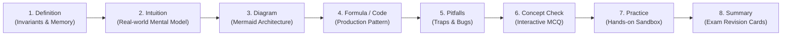
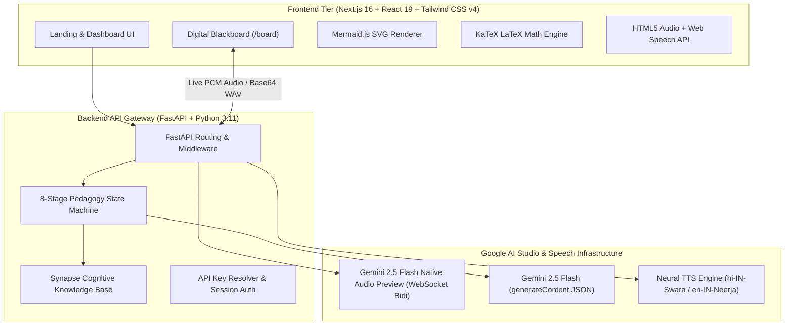

# 🎓 AI-Powered Cognitive E-Learning & Digital Blackboard Platform

[](https://nextjs.org/)
[](https://react.dev/)
[](https://fastapi.tiangolo.com/)
[](https://www.python.org/)
[](https://tailwindcss.com/)
[](https://polyformproject.org/licenses/noncommercial/1.0.0)

An advanced, autonomous **AI Educator & Interactive Digital Blackboard System** designed to deconstruct complex technical engineering subjects (Data Structures, Algorithms, Computer Systems, Machine Learning, and Engineering Mathematics) using an **8-stage pedagogical state machine**, real-time **Gemini 2.5 Flash Native Audio bidirectional spoken voice (Aoede)** in Professional Hinglish and Academic English, dynamic **Mermaid.js** architectural diagrams, **KaTeX** mathematical proofs, and an interactive **Code Execution Sandbox**.

---

## 🌟 Key Highlights & Capabilities

### 1. 🧠 Autonomous 8-Phase Pedagogy State Machine
Unlike standard AI chatbots that dump unreadable walls of text, this system acts as a Level-5 university professor ("Nova") by breaking down every technical topic into an 8-stage cognitive learning sequence:



---

### 2. 🎙️ Real-Time Spoken Audio Engine (Aoede)
- **Primary Live Engine**: Google **Gemini 2.5 Flash Native Audio** via WebSocket (`BidiGenerateContent`) using the female persona **`Aoede`** (24kHz 16-bit Mono PCM converted in-flight into WAV).
- **Secondary Neural Engine**: Ultra-fast **Hindi/Hinglish neural voice engine** (`hi-IN-Swara`, `en-IN-Neerja`) tailored for natural Indian technical educator cadence.
- **Zero-Latency Browser Priming**: Instant (<50ms) spoken audio triggers on user click to prevent browser autoplay blocking and eliminate dead silence while the backend streams full lecture cards.

---

### 3. 📊 Live Vector Diagrams (Mermaid.js) & Math Proofs (KaTeX)
- **Dynamic System Diagrams**: Visualizes pointer references (`p -> next`), memory allocations, binary tree structures, cache hierarchies, and algorithmic states as interactive SVG graphics.
- **KaTeX Mathematical Proofs**: High-speed typography rendering of LaTeX mathematical invariants, asymptotic formulas ($O(1)$, $\Theta(N \log N)$), and calculus derivations with zero layout shift.

---

### 4. 📸 Multimodal "Ctrl+V" Screenshot Doubt Solver
- **Clipboard & File Ingestion**: Capture any question or textbook diagram (`Win + Shift + S`) and press **Ctrl+V** directly in the Doubt Solver.
- **Visual OCR & Step-by-Step Solutions**: Formats solutions with direct answers, mathematical derivations, Mermaid flowcharts, and common exam traps.
- **Document Context Grounding**: Attach `.cpp`, `.py`, `.txt`, or `.md` files to ground queries in your personal course notes.

---

### 5. 💻 Interactive In-Browser Code Sandbox (`/sandbox`)
- **Multi-Language Support**: Write, run, and benchmark code in **C++, Python, and JavaScript**.
- **Complexity Annotator**: Real-time analysis of runtime efficiency and space overhead.
- **AI Debugger**: Instant one-click diagnostic and fix for segmentation faults, memory leaks, and logic errors.

---

### 6. 🎙️ AI Oral Viva Defense Examiner
- Simulates real technical interviews and university viva exams.
- The student speaks their explanation into the microphone; the AI grades articulation, conceptual depth, technical terminology, and delivers graded scorecards with follow-up questions.

---

### 7. 📅 Weighted Exam Syllabus Planner & Replanner (`weightage.json`)
- High-yield syllabus optimization for **GATE CS, JEE, NEET, and Technical Interview Prep (DSA)**.
- **Adaptive Re-planning**: Dynamically redistributes remaining high-weightage topics across remaining days if a student misses a milestone.

---

### 8. 🔁 Spaced Repetition Flashcards (SM-2 Algorithm)
- Uses the SuperMemo-2 algorithmic decay curve to calculate optimal review intervals (1, 3, 7, 14 days), preventing the Ebbinghaus forgetting curve.

---

## 🏗️ System Architecture



---

## 🗂️ Project Structure

```
ai-powered-elearning-platform/
├── backend/
│   ├── main.py              # FastAPI server, WebSocket Bidi client, TTS & pedagogy engine
│   ├── weightage.json       # Exam topic weights (GATE CS, NEET, JEE, DSA)
│   ├── requirements.txt     # Python dependencies (fastapi, uvicorn, websockets, httpx, edge-tts)
│   ├── .env.example         # Example backend environment variables
│   ├── test_backend.py      # Backend API integration tests
│   └── test_quiz_api.py     # Quiz API validation tests
├── frontend/
│   ├── src/
│   │   ├── app/
│   │   │   ├── page.tsx     # Landing Page & AI Study Planner
│   │   │   ├── board/       # Digital Blackboard & Voice Lecture Room
│   │   │   ├── dashboard/   # Course Syllabus & Milestone Dashboard
│   │   │   ├── sandbox/     # Interactive Code Execution Sandbox
│   │   │   ├── quiz/        # Adaptive Testing & Quiz Arena
│   │   │   ├── layout.tsx   # Root layout and metadata
│   │   │   └── globals.css  # Tailwind CSS v4 styles & custom themes
│   │   └── components/
│   │       ├── AIStudyPlanner.tsx         # Study plan generator
│   │       ├── UniversalAskAIModal.tsx    # Multimodal Doubt Solver
│   │       ├── FormattedBoardContent.tsx  # KaTeX & Mermaid blackboard renderer
│   │       ├── MathDeconstructorModal.tsx # Formula step-by-step breakdown
│   │       ├── OralVivaModal.tsx          # AI Speech Viva examiner
│   │       ├── SpacedRepetitionModal.tsx  # SM-2 Flashcard revision
│   │       ├── CodeSandboxModal.tsx       # Embedded code editor
│   │       ├── BooksReaderModal.tsx       # Textbook & notes reader
│   │       └── SettingsModal.tsx          # API Key & Voice config
│   ├── .env.example         # Example frontend environment variables
│   ├── package.json         # NPM packages (Next.js 16, React 19, Tailwind v4, KaTeX, Mermaid)
│   ├── tsconfig.json        # TypeScript configuration
│   └── next.config.ts       # Next.js build settings
├── .gitignore               # Root git ignore file
└── README.md                # Project documentation
```

---

## 🚀 Quick Start Guide

### Prerequisites
- **Node.js**: v18.18.0 or higher (v20+ recommended)
- **Python**: v3.10 or higher (v3.11 recommended)
- **Google Gemini API Key**: Free tier available from [Google AI Studio](https://aistudio.google.com/)

---

### Step 1: Clone Repository
```bash
git clone https://github.com/Rishabhkanhaiya/ai-powered-elearning-platform.git
cd ai-powered-elearning-platform
```

---

### Step 2: Backend Setup
1. Navigate to the backend directory:
   ```bash
   cd backend
   ```
2. Create and activate a Python virtual environment:
   ```bash
   # Windows (PowerShell)
   python -m venv venv
   .\venv\Scripts\Activate.ps1

   # macOS / Linux
   python3 -m venv venv
   source venv/bin/activate
   ```
3. Install dependencies:
   ```bash
   pip install -r requirements.txt
   ```
4. Configure environment variables:
   ```bash
   # Copy the example env file
   cp .env.example .env
   ```
   Open `.env` and paste your Gemini API Key:
   ```env
   GEMINI_API_KEY=your_actual_gemini_api_key_here
   ```
5. Start the backend server:
   ```bash
   python -m uvicorn main:app --host 0.0.0.0 --port 5000 --reload
   ```
   *The backend will be live at `http://localhost:5000` (API Docs at `http://localhost:5000/docs`).*

---

### Step 3: Frontend Setup
1. Open a new terminal window and navigate to the frontend directory:
   ```bash
   cd frontend
   ```
2. Install npm packages:
   ```bash
   npm install
   ```
3. Configure environment variables:
   ```bash
   # Copy the example env file
   cp .env.example .env.local
   ```
   Open `.env.local` and set:
   ```env
   NEXT_PUBLIC_GEMINI_API_KEY=your_actual_gemini_api_key_here
   ```
4. Start the Next.js development server:
   ```bash
   npm run dev
   ```
5. Open your browser and visit:
   ```
   http://localhost:3000
   ```

---

## 📡 API Reference

| Method | Endpoint | Description |
| :--- | :--- | :--- |
| `POST` | `/api/teach` | Generates 8-phase pedagogical teaching block with live Aoede voice audio data |
| `POST` | `/api/tts` | Synthesizes Gemini 2.5 Flash Native Audio (`Aoede`) via WebSocket |
| `POST` | `/api/ask` | Multimodal AI Doubt Solver (Text, Images, Code attachments) |
| `POST` | `/api/planner` | Creates weighted, day-by-day exam study roadmaps |
| `POST` | `/api/planner/replan` | Dynamically rebalances remaining syllabus milestones |
| `POST` | `/api/viva/evaluate` | Evaluates oral viva student voice transcript with scoring |
| `POST` | `/api/quiz` | Generates adaptive conceptual quizzes with instant feedback |
| `POST` | `/api/check-key` | Validates Gemini API key connection with Google AI Studio |

---

## 🛠️ Tech Stack Matrix

| Category | Technology |
| :--- | :--- |
| **Frontend Framework** | Next.js 16 (App Router, Turbopack) |
| **UI & Styling** | React 19, TypeScript, Tailwind CSS v4, Lucide Icons |
| **Diagrams & Math** | Mermaid.js v11, KaTeX (`react-latex-next`) |
| **Audio Processing** | Web Audio API, HTML5 Audio, Web Speech API |
| **Backend Framework** | FastAPI (ASGI), Python 3.11+, Uvicorn |
| **AI & Speech Models** | Google Gemini 2.5 Flash, Gemini 2.5 Flash Native Audio Preview (`Aoede`), Edge-TTS |
| **Networking & Protocols** | Async HTTPX, WebSockets (`BidiGenerateContent`) |

---

## 🛡️ Security & Privacy
- **Zero API Key Leakage**: No secrets or API keys are committed to the repository.
- **Client-Side Encryption**: User API keys stored in `localStorage` are only transmitted directly to Google AI Studio or your local backend proxy.

---

## 📄 License
This project is licensed under the [PolyForm Noncommercial License 1.0.0](LICENSE) — free for personal, academic, and non-commercial educational use. Commercial use requires prior written authorization.
